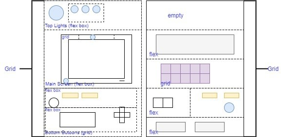

# Pokedex-online

## Sobre o projeto
Olá! Esse é um projeto pessoal que estou construindo, se esse readme ainda não foi atualizado é sinal que o projeto ainda não foi concluído, mas você pode acessa-lo no link abaixo e acompanhar como ele está nesse momento:

[site do projeto](https://martvie.github.io/Pokedex-online/)

Esse é um projeto de uma pokedex que você poderá acessar online, obtendo diversas informações sobre pokemons!
Pretendo desenvolver esse projeto utilizando da [PokeApi](https://pokeapi.co/) e colocar online assim que possível.

# Passos do Projeto

Nesse projeto pretendo praticar tanto habilidades em JavaScript como também habilidades CSS, para tal posso dividir ele em duas fases.
* Primeira
Desenvolver uma pokedex usando HTML e CSS, pretendo fazer uma pokedex completamente no navegador
* Segunda
Fazer o consumo da API citada para preencher os dados da pokedéx mediante a consulta do usuário.

# Passo atual
Construção da pokedex com auxílio do artigo do [oryam](https://dev.to/oryam/css-pokedex-3iln) seguindo o layout disponibilizado

